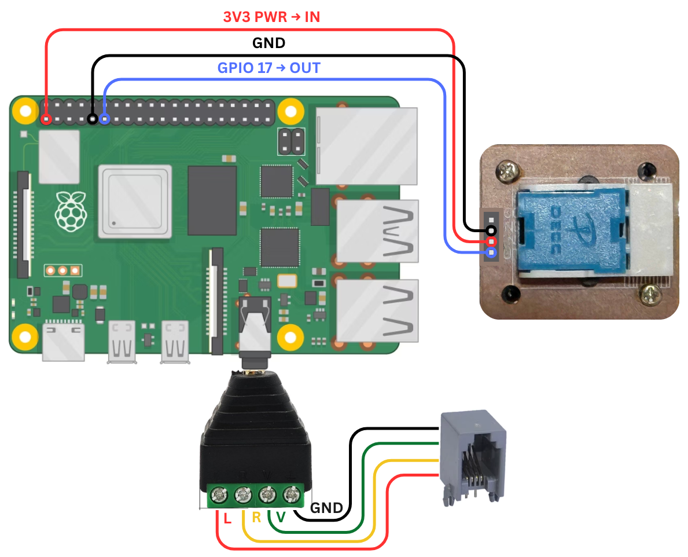

# Exhibition-Telephone
Raspberry Pi-powered retro telephone that plays custom audio when lifted

## Materials Used
- Raspberry Pi 3B or 4
- [Rotary Telephone](https://a.co/d/g6QHbtn)
- [4-Pole 3.5mm Jack to Screw-Terminal Block Adapter](https://a.co/d/8EKYkN0)
- [Female-to-Female Jumper Wires (x3)](https://a.co/d/6lHln8J)

## Prerequisites
- Python 3
  - signal
  - RPi.GPIO
  - time
  - subprocess
  - sys
- mpg123 (console MP3 player)
- vim (optional — for editing)
- Raspberry Pi OS (64-bit)

## Hardware Setup


Connect as shown:
- 3 jumper wires between the Pi and the phone’s hook switch
- 4 wires from RJ9 handset to the 3.5mm screw terminal breakout

## Raspberry Pi OS Setup
- Flash and boot Raspberry Pi OS (64-bit)
- Apply the following OS customization settings:
  - **General**
    - Hostname (optional)
    - Username — example used here: `baps`  
      *(If using another username, update paths in scripts and service.)*
    - Wi-Fi (optional but recommended for SSH/file transfer)
  - **Services**
    - Enable SSH with password authentication

## Script Setup
1) **Install dependencies**
    ```bash
    sudo apt update
    sudo apt install mpg123 vim python3-rpi.gpio
    ```
2) **Set volume to max**
    ```bash
    amixer set 'Master' 100%
    ```
3) **Copy necessary files**
   - `phoneplayer.py` → `/home/baps/`
   - `FamilyUnity.mp3` → same folder as `phoneplayer.py`
     - If using a different audio file, update the path in `phoneplayer.py` (line 8)
   - `phone.service` → `/etc/systemd/system/`
     - If you copied all the files in the same directory you can simply run
       ``` bash
       mv phone.service /etc/systemd/system/
       ```
       > **Note:** if you have a different username and or path, be sure to update **lines 7 and 10** respectfully
4) **Enable and start the service**
   - Run the following commands to start the service so the script automatically starts as soon as the Raspbery Pi is powered on
     - ```bash
       sudo systemctl daemon-reload
       sudo systemctl enable phone.service
       sudo systemctl start phone.service
       ```
     - To check if the service is running run this command
       ```bash
       sudo systemctl status phone.service
       ```
       Expected `Active: active (running)`
      
5. **Test your setup**
   It should be running now so simply press the button or pick up the phone and see if the audio plays

